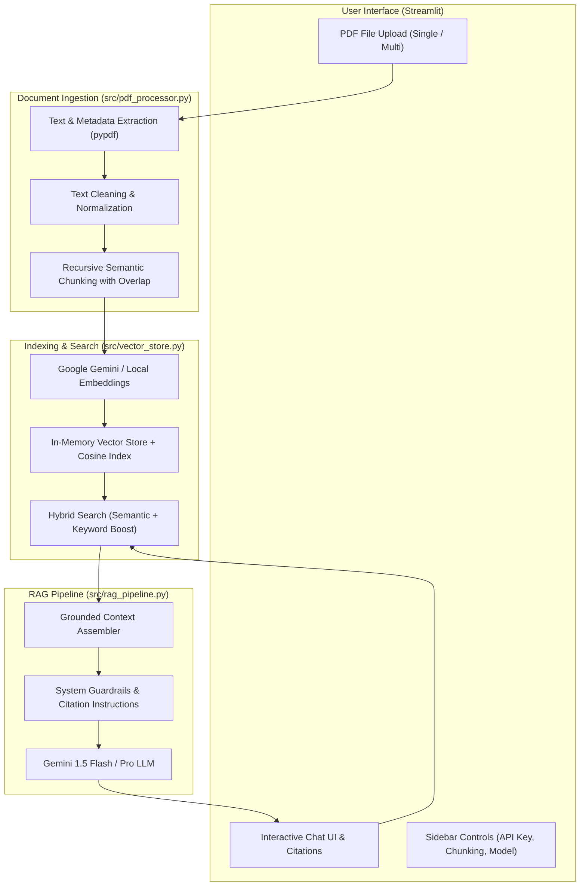

# AI PDF Q&A Assistant 📄🤖

An enterprise-ready, modular document intelligence tool that enables users to upload PDF documents and ask questions in natural language. Powered by **Retrieval-Augmented Generation (RAG)**, **Google Gemini LLMs**, and **Hybrid Vector Search**.

[](https://github.com/VamaRanderia/ai-pdf-qa-assistant/actions)
[](https://www.python.org/downloads/)
[](https://opensource.org/licenses/MIT)

---

## 🌟 Key Features

- **Multi-Document Ingestion**: Upload one or multiple PDF documents simultaneously.
- **Hierarchical Text Chunking**: Recursive character chunker preserving paragraph and sentence boundaries with configurable overlap.
- **Hybrid Retrieval**: Combines semantic embedding similarity with keyword token overlap boosting for maximum precision.
- **Strict Grounding & Citations**: Answers are backed by expandable source citation cards specifying the exact source document, page number, and text excerpt.
- **Zero-Config Offline Mode**: Seamless extractive fallback engine that operates immediately even without an external API key or network connection.
- **Interactive Web Interface**: Streamlit UI with parameter tuning (chunk size, overlap, top-k), conversation history, and Markdown transcript export.
- **Full Test Coverage**: Automated test suite (`unittest` / `pytest`) and continuous integration via GitHub Actions.

---

## 🏛️ System Architecture



---

## 📁 Project Structure

```text
ai-pdf-qa-assistant/
├── .github/
│   └── workflows/
│       └── ci.yml               # Automated multi-python CI testing
├── src/
│   ├── __init__.py              # Package initializer
│   ├── config.py                # Centralized configuration & settings
│   ├── pdf_processor.py         # PDF text extraction & recursive chunker
│   ├── vector_store.py          # Vector store & hybrid retrieval engine
│   └── rag_pipeline.py          # Prompt engineering & Gemini RAG orchestrator
├── tests/
│   ├── __init__.py
│   ├── test_pdf_processor.py    # Unit tests for text cleaning and chunking
│   ├── test_vector_store.py     # Unit tests for vector indexing & cosine search
│   └── test_rag_pipeline.py     # Unit tests for RAG pipeline & citations
├── .env.example                 # Environment variable templates
├── .gitignore                   # Version control ignore rules
├── app.py                       # Modern Streamlit web application
├── requirements.txt             # Project dependencies
└── README.md                    # Project documentation
```

---

## 🚀 Getting Started

### 1. Prerequisites
- Python 3.10 or higher
- Git

### 2. Installation

Clone the repository:
```bash
git clone https://github.com/VamaRanderia/ai-pdf-qa-assistant.git
cd ai-pdf-qa-assistant
```

Create and activate a virtual environment:
```bash
# Windows (PowerShell)
python -m venv venv
.\venv\Scripts\Activate.ps1

# macOS / Linux
python3 -m venv venv
source venv/bin/activate
```

Install dependencies:
```bash
pip install -r requirements.txt
```

### 3. API Key Setup (Optional)
To enable AI conversational synthesis via Google Gemini:
1. Obtain a free API key from [Google AI Studio](https://aistudio.google.com/app/apikey).
2. Copy `.env.example` to `.env`:
   ```bash
   cp .env.example .env
   ```
3. Add your key inside `.env`:
   ```env
   GEMINI_API_KEY=your_actual_api_key_here
   ```
*(Note: You can also enter or change your API key directly inside the web app sidebar at runtime).*

### 4. Running the Application

Launch the Streamlit web interface:
```bash
streamlit run app.py
```
Open your browser to `http://localhost:8501`.

---

## 🧪 Running Tests

Run the complete automated test suite locally:
```bash
python -m unittest discover -s tests -v
```

Or using pytest:
```bash
pytest tests/ -v
```

---

## ⚙️ Configuration Options

Parameters can be adjusted in `src/config.py` or directly in the UI sidebar:

| Parameter | Default | Description |
|-----------|---------|-------------|
| `chunk_size` | `600` | Target character size for each semantic passage |
| `chunk_overlap` | `120` | Overlap between consecutive passages to retain context |
| `top_k` | `4` | Number of most relevant passages retrieved for generation |
| `use_hybrid_search` | `True` | Enhances dense vector matching with keyword term overlap |
| `llm_model_name` | `gemini-1.5-flash` | Gemini model name (`gemini-1.5-flash` or `gemini-1.5-pro`) |

---

## 📄 License

Distributed under the MIT License. See `LICENSE` for more information.
